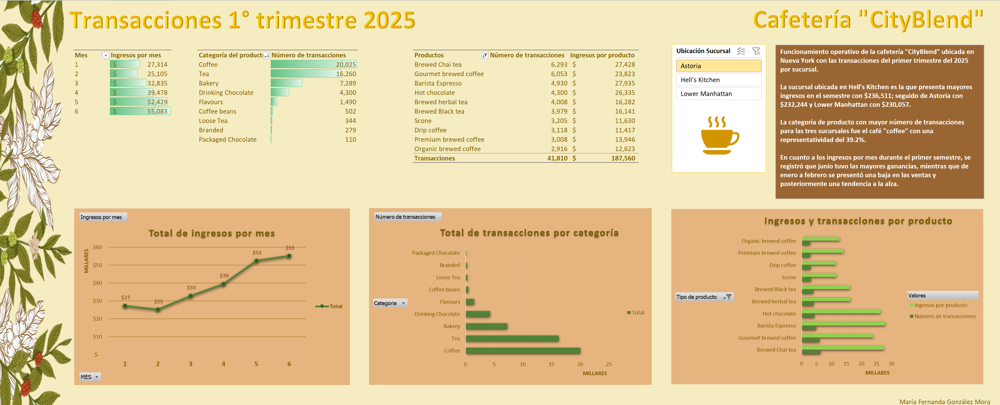

# Excel — CityBlend Sales Dashboard (NYC)

Dashboard en Excel para analizar transacciones de la cafetería **CityBlend** (Nueva York) durante 6 meses (enero–junio). El objetivo es visualizar patrones de ingresos y transacciones para detectar oportunidades operativas por sucursal, categoría y producto.

**Repo:** https://github.com/mariafernandaglezmora-01/Excel_CityBlend_SalesDashboard

---

## Vista rápida

---

## Objetivo
Transformar y visualizar los datos para que el negocio pueda:
- monitorear **ingresos por mes**,
- identificar **categorías/productos** con mayor demanda,
- comparar desempeño por **sucursal**.

---

## Qué incluye el dashboard
- **Ingresos por mes** (línea).
- **Transacciones por categoría** (barras).
- **Top productos** por transacciones e ingresos.
- Segmentación por **sucursal** (Astoria, Hell’s Kitchen, Lower Manhattan).

---

## Metodología (resumen)
- Preparación de datos (columnas derivadas):
  - **Ingresos = precio × cantidad**
  - **Mes = MES(fecha)**
- Tablas dinámicas:
  - ingresos por mes,
  - transacciones por categoría,
  - transacciones e ingresos por producto (Top 10).
- Construcción de dashboard con gráficos y segmentadores.

---

## Archivo
- Dashboard (Excel): [CityBlend_SalesDashboard.xlsx](dashboard/CityBlend_SalesDashboard.xlsx)

---

## Herramientas
Excel (tablas dinámicas, gráficos, segmentadores, formato condicional)

---

## Nota
Proyecto publicado con fines educativos y de portafolio. Datos usados para análisis demostrativo.

